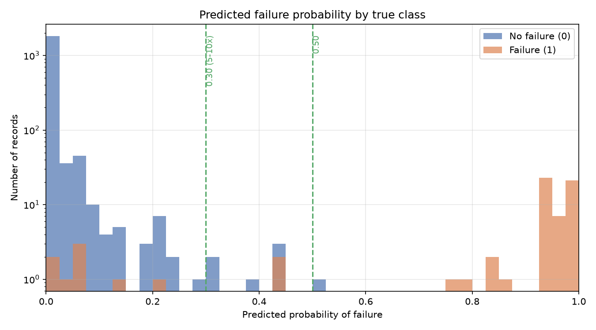

# Predictive Maintenance — Machine Failure Prediction

End-to-end machine-learning project that predicts whether an industrial machine
will fail (`0` = no failure, `1` = failure) from process telemetry, using the
[AI4I 2020 Predictive Maintenance dataset](https://archive.ics.uci.edu/dataset/601/ai4i+2020+predictive+maintenance+dataset).

Failures are rare (~3.3% of records), so the project is treated as an
**imbalanced binary classification** problem and is evaluated on precision,
recall, F1 and PR-AUC rather than accuracy.

## What this project demonstrates

- A full ML lifecycle: EDA → cleaning → reproducible preparation → baseline
  modeling → controlled feature experiment → final model → calibration & drift
  monitoring → a validated batch-inference boundary with tests.
- Careful, leakage-free methodology: failure-subtype flags and identifiers are
  never used as features, scaling is fit on the training data only, and the
  decision threshold is chosen from out-of-fold cost analysis — never tuned on
  the test set.
- Reproducibility: a fixed, stratified split, a scriptable pipeline, and a
  packaged model artifact (`models/final_model.joblib`) consumed by both the
  notebooks and the production inference module.

## Key results

Baseline models on the 2,000-record development split (decision threshold 0.5):

| Model | Precision | Recall | F1 | ROC-AUC | PR-AUC | FP | FN |
|---|---|---|---|---|---|---|---|
| Dummy Classifier | 0.000 | 0.000 | 0.000 | 0.500 | 0.033 | 0 | 66 |
| Logistic Regression | 0.160 | 0.848 | 0.269 | 0.920 | 0.419 | 295 | 10 |
| Random Forest | 0.846 | 0.833 | 0.840 | 0.991 | 0.893 | 10 | 11 |
| Gradient Boosting | 0.881 | 0.788 | 0.832 | 0.994 | 0.915 | 7 | 14 |

Adding the engineered `OSF criterion = Tool wear [min] * Torque [Nm]` feature
(notebook [`05_feature_experiment.ipynb`](notebooks/05_feature_experiment.ipynb))
markedly improves the best model:

| Model | Precision | Recall | F1 | ROC-AUC | PR-AUC | FP | FN |
|---|---|---|---|---|---|---|---|
| Gradient Boosting + OSF criterion | 0.983 | 0.848 | 0.911 | 0.995 | 0.936 | 1 | 10 |

> These figures come from the development split, which was already used during
> exploration and feature design. They are a development check, not untouched
> final validation — see [Limitations](#limitations-and-next-steps).

### Final-model probability separation



The logarithmic count scale keeps the rare borderline records visible. Most
non-failures receive probabilities close to `0`, while most failures are close
to `1`; the dashed lines mark the two documented decision thresholds (`0.30`
and `0.50`).

## Final model

[`python/final_model.py`](python/final_model.py) trains and saves the selected
configuration to `models/final_model.joblib`:

- **Model:** `GradientBoostingClassifier(random_state=42)`.
- **Features (7):** `Type_L`, `Type_M`, `Temperature difference`,
  `Rotational speed [rpm]`, `Power [W]`, `Tool wear [min]`, `OSF criterion`
  (raw `Torque [Nm]` and `Process temperature [K]` were dropped as redundant —
  the failure signal lives in `Temperature difference` and in `Power`/`OSF`).
- **Threshold:** depends on the assumed cost ratio of a missed failure to a
  false alarm. Out-of-fold cost analysis (`results/final_threshold_costs.csv`)
  gives: `1x → 0.60`, `5–10x → 0.30`, `20x → 0.15`, `30–50x → 0.05`.

Development-split behaviour of the final model at two representative thresholds:

| Threshold | Precision | Recall | F1 | FP | FN | Use when |
|---|---|---|---|---|---|---|
| 0.30 | 0.892 | 0.879 | 0.885 | 7 | 8 | missed failures cost 5–10× a false alarm |
| 0.50 | 0.983 | 0.848 | 0.911 | 1 | 10 | false alarms are the binding constraint |

Working recommendation: **0.30**. The final threshold should be fixed once real
FP/FN business costs are known.

## Repository structure

```
data/
  raw/                original dataset (produkcja.csv)
  processed/          cleaned data + train/test artifacts (raw & scaled) + target
  test/               small fixtures for the batch-inference tests
models/
  final_model.joblib  model + scaler + feature list + per-cost-ratio thresholds
python/                reusable, importable modules (see below)
notebooks/             the analysis narrative, 01 → 07
results/               exported metrics, error tables and figures
tests/                 unit tests for the batch-inference boundary
requirements.txt
```

### Python modules (`python/`)

| Module | Purpose |
|---|---|
| `cleaning.py` | Load raw data, engineer features, correct inconsistent labels, write `produkcja_clean.csv`. |
| `data_preparation.py` | Reproducible 80/20 stratified split, train-only scaling, save the six CSV artifacts. |
| `features.py` | `add_osf_criterion` and other shared feature helpers. |
| `evaluation.py` | Cross-validation, metrics, threshold analysis, out-of-fold probabilities. |
| `visualization.py` | Confusion-matrix and threshold-analysis plots. |
| `sensitivity_analysis.py` | Sensitivity of results to the 9-label correction (330 vs 339 positives). |
| `final_model.py` | Train and serialize the final model artifact. |
| `plot_final_probabilities.py`, `plot_calibration.py` | Final-evaluation figures. |
| `drift_monitoring.py`, `check_drift.py` | PSI-based data-drift monitoring tool. |
| `batch_inference.py` | Validated batch scoring: raw input → feature engineering → prediction report. |

### Notebooks

| Notebook | Content |
|---|---|
| [`01_eda.ipynb`](notebooks/01_eda.ipynb) | Exploratory analysis; failure mechanisms (TWF/HDF/PWF/OSF) and their parameter ranges. |
| [`02_data_cleaning.ipynb`](notebooks/02_data_cleaning.ipynb) | Feature engineering, label correction, leakage-column removal, one-hot encoding. |
| [`03_data_preparation.ipynb`](notebooks/03_data_preparation.ipynb) | Stratified split, train-only scaling, dataset validation and export. |
| [`04_modeling.ipynb`](notebooks/04_modeling.ipynb) | Baseline models and false-positive / false-negative error analysis. |
| [`05_feature_experiment.ipynb`](notebooks/05_feature_experiment.ipynb) | OSF-criterion experiment, feature importance, reduced feature set. |
| [`06_final_evaluation.ipynb`](notebooks/06_final_evaluation.ipynb) | Probability distribution, calibration (Brier score) and drift-tool demonstration. |
| [`07_batch_inference.ipynb`](notebooks/07_batch_inference.ipynb) | Demonstrates the reusable `batch_inference.py` boundary. |

## Methodology notes

- **No data leakage.** `TWF`, `HDF`, `PWF`, `OSF`, `RNF` (failure subtypes),
  `UDI`, `Product ID` and `record_index` are excluded from the features.
  `record_index` is kept only to trace predictions back to their source record.
- **Engineered features.** `Power [W] = Rotational speed × Torque × 2π/60`,
  `Temperature difference = Process − Air temperature`, and
  `OSF criterion = Tool wear × Torque`.
- **Label correction.** Nine records had `Machine failure = 1` while every
  failure-subtype flag was 0; their parameters are unremarkable, so they are
  treated as label noise and set to 0 (330 positives). A sensitivity analysis
  confirms this correction does not drive the results.
- **Imbalance.** Accuracy is reported but never used to compare models.

## Installation

```powershell
python -m venv .venv
.venv\Scripts\Activate.ps1
python -m pip install -r requirements.txt
```

Python 3.12 is the tested and supported version for the pinned environment.

## Reproduce the pipeline

From the project root, with the virtual environment activated:

```powershell
# 1. Clean the raw data and engineer features
python python/cleaning.py

# 2. Split, scale (train-only) and export the datasets
python python/data_preparation.py

# 3. Train and serialize the final model artifact
python python/final_model.py
```

Step 2 writes six files to `data/processed/` — raw and scaled features,
`y_train`/`y_test`, each keyed by `record_index`.

## Figures

All the important plots live as reusable functions in
[`python/visualization.py`](python/visualization.py) (single source of truth for
the notebooks) and are rendered to `results/` by dedicated runner scripts:

```powershell
python python/generate_figures.py          # EDA + final-model feature importance
python python/plot_final_probabilities.py  # predicted-probability distribution
python python/plot_calibration.py          # reliability diagram + Brier score
python python/check_drift.py               # data-drift (PSI) report
```

`generate_figures.py` produces, in `results/`:

| File | Plot |
|---|---|
| `eda_correlation_matrix.png` | Correlation of process parameters. |
| `eda_failure_map.png` | Rotational speed vs Torque per machine type, failures in red. |
| `eda_osf_criterion.png` | Tool wear × Torque with the empirical OSF boundary. |
| `eda_twf_tool_wear.png` | Tool wear distribution split by the TWF flag. |
| `eda_hdf_temperature_difference.png` | Temperature difference split by the HDF flag. |
| `eda_pwf_power.png` | Power distribution split by the PWF flag. |
| `final_model_feature_importance.png` / `.csv` | Impurity-based feature importance of the final model. |

## Batch inference

Score a batch of raw measurements with the final model. The module validates the
input, recreates the training-time features, and writes a traceable report
(probability, decision, threshold and a content-based model version):

```powershell
python python/batch_inference.py data/test/valid_input.csv results/batch_predictions.csv --threshold 0.30
```

Run the tests for the inference boundary:

```powershell
python -m unittest discover -s tests -v
```

## Calibration and drift monitoring

- **Calibration** ([`06_final_evaluation.ipynb`](notebooks/06_final_evaluation.ipynb)):
  reliability curve and Brier score on out-of-fold and test probabilities
  (Brier ≈ 0.005) — the model is well calibrated at the dense extremes.
- **Drift monitoring** (`python/check_drift.py`): Population Stability Index on
  numeric features plus a proportion difference on the binary type features.
  A PSI above 0.25 on a feature the model relies on (Power, rpm, Temperature
  difference, OSF criterion) is the trigger to investigate. The tool has so far
  only been sanity-checked on train vs test; it awaits real production data.

## Limitations and next steps

- The 2,000-record test split was used during model comparison and feature
  design, so it is a **development set**, not an untouched final test set.
  Genuine validation needs a future/held-out batch collected after the model
  was frozen.
- The final decision threshold is a working recommendation; fixing it requires
  **real FP/FN business costs**.
- Drift monitoring should be run against **real production data** once it exists.

These remaining items depend on external input (business costs and future data)
rather than on further modeling work.
